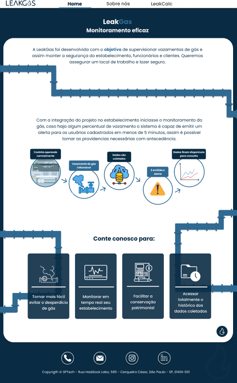

# Leak Gas - Monitoramento Inteligente de Gás

## Integrantes:
### - Luíza Vicente Pompermayer - 01242049 
### - Lucas Rodrigues Cartaxo - 01242089 
### - Linya Alves Mendonça - 01242030 
### - Pedro Henrique Morais Pereira - 01242067  
### - Rafael Pavani de Souza Silva - 01242003  
### - Rayra Ferreira Galvão da Silva – 01242054 
### - Viviane dos Santos – 01242050 

## Desafios:
- Precisão e confiabilidade dos sensores
- Gerenciamento de Alarmes e Respostas
- Educação e treinamento
- Manutenção e suporte

## Problemas:
- Segurança dos Funcionários
- Risco de Incêndios e Explosões.
- Cumprimento de Normas de Segurança
- Custos e prejuízos Financeiros

## O que é a Leak Gas?
A LeakGas é uma empresa de monitoramento de vazamento de gás em cozinhas industriais.

## Qual nosso objetivo?
Foi fundada com o objetivo de monitorar o vazamento de gases em cozinhas industriais, gerar dados e dashboards intuitivos permitindo que o cliente tome decisões baseadas no nosso sistema.

## Solução
A Leakgás oferecerá uma solução inteligente de monitoração do ambiente, caso ocorra um vazamento de gás, nós iremos imitir um alerta visual por meio site institucional.
Embora nossa prioridade seja o monitoramento eficiente, essa detecção rápida ajudará a proteger seus funcionários oque irá evitar desperdicios de gás e também irá preservar seu patrimõnio.
Com a Leakgás seu estabelecimento estará preparado para agir e operar com efiência, além de reforçar uma imagem de responsabilidade e inovaçao do seu negócio.

## To-Do List
- [x] Logo do Projeto
- [x] Documentação Inicial
- [x] Diagrama de Visão de Negócios
- [x] Site Institucional       
- [x] Levantamento de Requisitos
- [x] Instalação de VM com Lubunt
- [x] Programa Arduino coletando os dados
- [x] Tabelas Banco de Dados (MySQL)
- [x] Calculadora Financeira
- [x] PowerPoint Sprint1

## Ferramentas Utilizadas
 

## Site Institucional
#### Home

### Sobre nós

 
### LeakCalc

### Chat

## Links
[Trello](https://trello.com/b/fyMIWQUe/leakgas)
[Trello - Requisitos](https://trello.com/b/ngaoxIbc/leakgas-requisitos)
[Figma - Protótipo](https://www.figma.com/design/jppv5fyG7OaXwq2koobL0G/LeakGas?node-id=0-1&node-type=canvas&t=QrTuzWsiW86Nv6cm-0)
